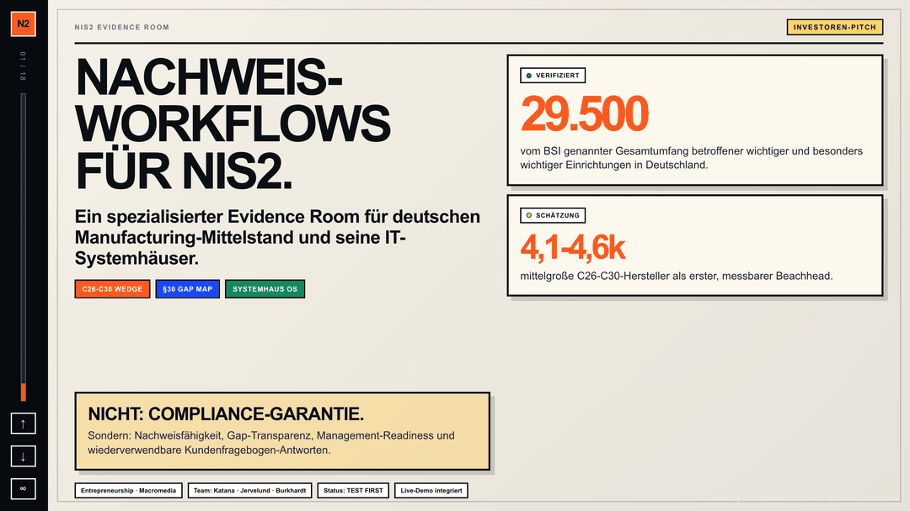

# NIS2 Evidence Room — Live Pitch & Functional Demo

> Browser-native Pitch-Deck mit eingebetteter, klickbarer Produkt-Demo.
> Studentisches Entrepreneurship-Projekt — Macromedia Hochschule München.

**Live Demo:** [smashburger-dev.github.io/nis2-pitch-demo](https://smashburger-dev.github.io/nis2-pitch-demo/)
**Status:** Work in Progress · Prüfungsabgabe Sommer 2026



---

## Was das ist

Ein vollständig im Browser laufender 18-Slide-Pitch zur **NIS2-Compliance** für den deutschen Mittelstand — inklusive **iframe-eingebetteter, interaktiver Produkt-Demo** (Betroffenheitscheck, §30 Gap Map, Evidence Room, Fragebogen-Builder, GF-Cockpit, Systemhaus Partner View).

Aufgebaut nach der **9-Punkte-Pitch-Struktur** aus Macromedia Entrepreneurship Unit 5.

## Warum das relevant ist

Seit dem **06. Dezember 2025** ist das NIS2UmsuCG in Deutschland in Kraft — ohne Übergangsfrist. Geschätzt **~80 % der betroffenen Unternehmen** wissen nicht, dass sie reguliert werden. Nur **11.500 von 29.500 NIS2-pflichtigen Unternehmen** haben sich beim BSI registriert.

## Struktur

```
.
├── index.html       Live-Pitch (18 Slides, Keyboard-Navigation, Fullscreen)
├── demo.html        Functional Product Demo (6 klickbare Workspace-Screens)
├── mockups.html     Product Mockup Pack (A4 Landscape, Übersicht)
└── README.md
```

### Controls (index.html)

- `← →` Slide navigation
- `F` Fullscreen
- `H` Handout-Modus
- Side-Rail mit Slide-Index

## Tech & Workflow

Kein Framework. Kein Build-Step. Drei statische HTML-Dateien, gebaut mit:

- **Claude Code** (Anthropic) und **OpenCode** — laufen **synchron in meinem Obsidian-Vault** und greifen über einen geteilten Memory-Layer (`claude-mem`) auf denselben Projektkontext zu. Geplant, gebaut und gepusht aus dem Vault heraus.
- **Vanilla HTML/CSS/JS** — bewusst dependency-frei, damit das Deck in jedem Browser auf jedem Rechner offline läuft.
- **iframe-Embedding** — die Live-Demo läuft direkt im Pitch-Deck, mit `focusDemo()`-Helper zum Springen in einzelne Demo-Sections per Button.

## Team

- **Noa Katana** — Produktvision, Build, Pitch-Architektur
- **Laurids Jervelund**
- **Johannes Burkhardt**

> Macromedia Hochschule München · KMM B.A. · Entrepreneurship-Kurs · Prof. zugeordnet im Kursplan

## Was hier *nicht* drin ist

Bewusst weggelassen, da Prüfung WIP:

- Vollständige Marktforschung & Evidence Matrix
- Customer Interview Scripts
- Pricing-Snapshots der Wettbewerber
- Finanzplanung & Beachhead Estimates
- Kursmaterialien der Hochschule (Macromedia Copyright)

## Lizenz

Code unter MIT. Inhalte (Pitch-Texte, Produkt-Mockups) bleiben Eigentum des Teams.

---

*Gebaut als Beweis, dass ein KMM-Student ohne klassischen Code-Background mit AI-gestützten Workflows ein vollständiges, produkt-demoables Pitch-Deck shippen kann.*
